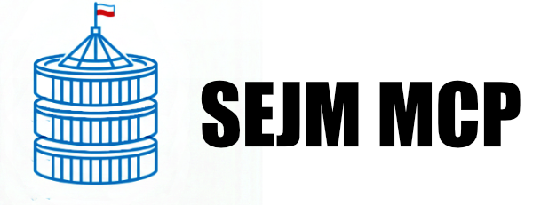

# Parliament of Poland MCP Server

An MCP server for the Polish Parliament public API.

## Usage

This server is designed to be run with `npx`, allowing you to use it as a tool provider for LLM clients without a global installation.

### Running with `npx`

To start the server, run the following command:

```bash
npx parliament-poland-mcp-server
```

### Configuration for LLM Clients

To integrate this server with an LLM client (like LM Studio or others that support MCP), you can configure it to spawn the server process. Here is an example configuration:

```json
{
  "mcpServers": {
    "parliament-poland-mcp-server": {
      "command": "npx",
      "args": [
        "-y",
        "parliament-poland-mcp-server"
      ]
    }
  }
}
```

This configuration tells the client how to start the tool server.

## Server Functions

The server provides the following functions:

### Bilateral Groups

*   `getBilateralGroupsTool`: Get a list of bilateral groups in the Sejm.

### Clubs

*   `getClubsTool`: Get a list of clubs for a given term.
*   `getClubTool`: Get detailed information about a specific club.

### Committees

*   `getCommitteesTool`: Get a list of committees for a given term.
*   `getCommitteeTool`: Get detailed information about a specific committee.

### Interpellations

*   `getInterpellationsTool`: Get a list of interpellations for a given term.
*   `getInterpellationTool`: Get detailed information about a specific interpellation.

### MPs

*   `getMpTool`: Get information about a member of Parliament.
*   `getMpsTool`: Get a list of MPs for a given term.

### Prints

*   `getPrintsTool`: Get a list of prints for a given term.
*   `getPrintTool`: Get detailed information about a specific print.

### Proceedings

*   `getProceedingsTool`: Get a list of proceedings for a given term.

### Legislative Process

*   `getProcessTool`: Get information about a specific legislative process.
*   `getProcessesTool`: Get a list of legislative processes for a given term.

### Terms

*   `getTermsTool`: Get a list of Sejm terms.

### Transcripts

*   `getTranscriptsTool`: Get a list of transcripts for a given term.

### Videos

*   `getVideosTool`: Get a list of video recordings for a given term.

### Votings

*   `getVotingsTool`: Get a list of votings for a given term.

### Written Questions

*   `getWrittenQuestionsTool`: Get a list of written questions for a given term.

## Development

To run the server in a development environment:

1.  Clone the repository.
2.  Install dependencies: `npm install`
3.  Build the project: `npm run build`
4.  Run the server: `npm start`

## Author

Piotr Kolawa ([@pkolawa](https://github.com/pkolawa)) / ([Linkedin](https://linkedin.com/in/pkolawa))

## License

This project is licensed under the MIT License - see the [LICENSE](LICENSE) file for details.